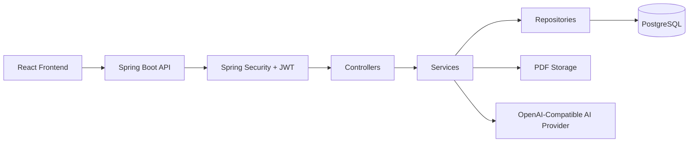
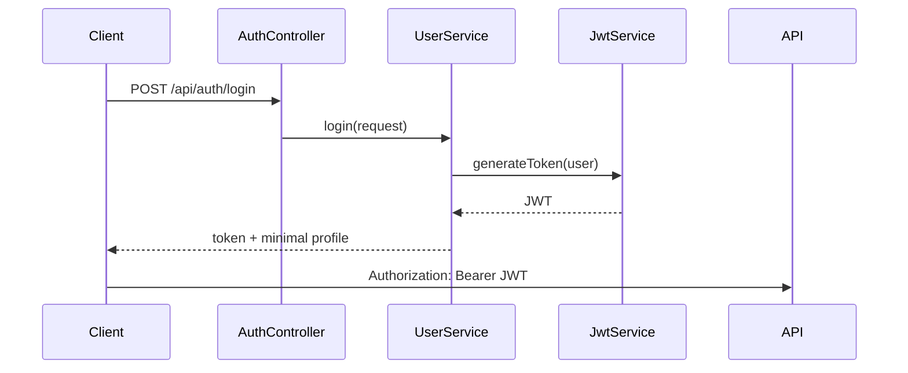
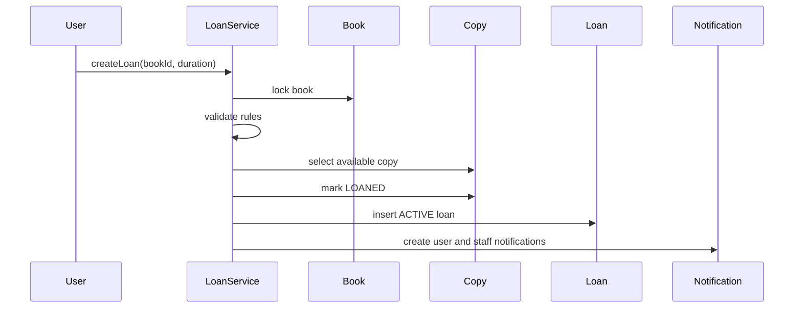
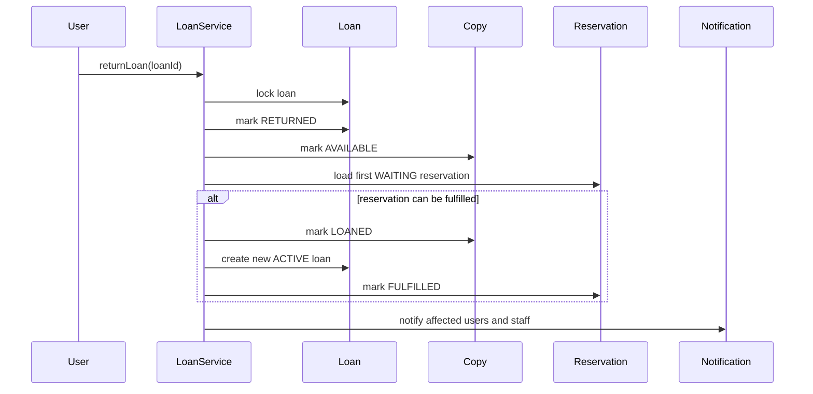

# BookWorm Backend

BookWorm Backend is the Spring Boot API for a transactional digital library platform. It manages authentication, books, copies, loans, reservations, reviews, favorites, notifications, PDF storage, and AI-assisted reading workflows.

The backend is designed around strict business consistency. Borrowing, returning, reserving, renewing, moderating, and deleting resources are transactional operations that affect multiple tables and must remain correct under concurrent usage.

## Table Of Contents

- [System Overview](#system-overview)
- [Architecture](#architecture)
- [Core Capabilities](#core-capabilities)
- [Technology Stack](#technology-stack)
- [Project Structure](#project-structure)
- [Runtime Configuration](#runtime-configuration)
- [Local Development](#local-development)
- [Database And Migrations](#database-and-migrations)
- [Security Model](#security-model)
- [Transactional Workflows](#transactional-workflows)
- [API Documentation](#api-documentation)
- [Development Workflow](#development-workflow)
- [Documentation](#documentation)

## System Overview

BookWorm exposes a REST API consumed by the React frontend. It persists data in PostgreSQL through Spring Data JPA and manages schema changes with Flyway.



## Architecture

The backend follows a layered architecture:

```text
src/main/java/com/lassriver/bookworm/
  config/        Global configuration, security configuration, seed data
  controllers/   REST controllers
  dtos/          Request and response DTOs
  entities/      JPA entities and enums
  exceptions/    API error model and global exception handling
  repositories/  Spring Data JPA repositories
  security/      JWT service, authentication filter, user details service
  services/      Business interfaces, implementations, AI client
```

Layer responsibilities:

| Layer | Responsibility |
|---|---|
| Controllers | Receive HTTP requests, validate DTOs, extract authenticated user, delegate to services |
| DTOs | Define public request and response contracts |
| Services | Enforce business rules and transaction boundaries |
| Repositories | Encapsulate database access |
| Entities | Represent persisted relational state |
| Exceptions | Normalize error responses |
| Security | Validate JWTs and enforce route permissions |

## Core Capabilities

### Users And Authentication

- User registration.
- Login with JWT generation.
- Profile retrieval and update.
- Password change.
- Minimum registration age validation.
- Argon2 password hashing.

### Catalog And Inventory

- Paginated book catalog.
- Search and filters by title, category, language, status, and availability.
- Catalog facets for categories and languages.
- Book creation and update.
- Book activation and inactivation.
- Book deletion with safety checks.
- Copy creation and retirement.

### Loans And Reservations

- Loan creation with copy assignment.
- Loan return.
- Automatic reservation fulfillment after returns.
- Loan renewal with audit history.
- Reservation queue creation.
- Reservation cancellation.
- 24-hour cooldown after returning the same book.
- Maximum active-loan limits.

### Reviews And Favorites

- Favorite toggle per user and book.
- Review creation.
- Public visible review listing.
- Staff review moderation.
- Rating aggregation from visible reviews only.

### Notifications

- Persistent user notifications.
- Staff notifications for operational events.
- Unread count.
- Mark one notification as read.
- Mark all notifications as read.
- Deduplication through `dedupeKey`.
- Scheduled due-soon and overdue notifications.

### PDF Reading And AI Chat

- PDF upload by staff.
- Remote PDF download from allowed HTTPS hosts.
- PDF reading for users with active loans.
- AI chat over Server-Sent Events.
- System provider API key with optional personal-key fallback.

## Technology Stack

| Area | Technology |
|---|---|
| Language | Java 25 |
| Framework | Spring Boot 4.0.5 |
| Web layer | Spring WebMVC |
| Persistence | Spring Data JPA |
| Database | PostgreSQL |
| Migrations | Flyway |
| Security | Spring Security, JWT, Argon2 |
| Validation | Jakarta Validation |
| API docs | SpringDoc OpenAPI |
| Testing | JUnit, Spring Boot Test, Testcontainers, H2 |
| Build | Maven |
| Utility | Lombok |

## Project Structure

```text
src/
  main/
    java/com/lassriver/bookworm/
      BookwormApplication.java
      config/
      controllers/
      dtos/
        request/
        response/
      entities/
        enums/
      exceptions/
      repositories/
      security/
      services/
        ai/
        impl/
    resources/
      application.yml
      db/migration/
  test/
    java/com/lassriver/bookworm/
```

## Runtime Configuration

The default active profile is:

```yaml
spring:
  profiles:
    active: dev
```

The `dev` profile reads environment variables and optionally imports `env.properties`.

Important variables:

| Variable | Default | Purpose |
|---|---|---|
| `DB_URL` | `jdbc:postgresql://localhost:5432/bookworm` | PostgreSQL JDBC URL |
| `DB_USERNAME` | `postgres` | Database user |
| `DB_PASSWORD` | `1234` | Database password |
| `BOOKWORM_PDF_DIR` | `uploads/pdfs` | PDF storage directory |
| `BOOKWORM_MAX_PDF_BYTES` | `52428800` | Maximum PDF size |
| `BOOKWORM_ALLOWED_PDF_HOSTS` | empty | Comma-separated allowlist for remote PDF downloads |
| `BOOKWORM_AI_BASE_URL` | `https://api.deepseek.com` | OpenAI-compatible provider base URL |
| `DEEPSEEK_API_KEY` | empty | System AI provider key |
| `BOOKWORM_AI_MODEL` | `deepseek-v4-flash` | AI model name |

Example `env.properties`:

```properties
DB_URL=jdbc:postgresql://localhost:5432/bookworm
DB_USERNAME=postgres
DB_PASSWORD=1234
BOOKWORM_ALLOWED_PDF_HOSTS=archive.org,ia800100.us.archive.org
DEEPSEEK_API_KEY=your-system-key
```

## Local Development

Start PostgreSQL and create the database:

```sql
CREATE DATABASE bookworm;
```

Run the application:

```bash
./mvnw spring-boot:run
```

On Windows:

```bash
.\mvnw.cmd spring-boot:run
```

Run unit tests:

```bash
./mvnw test
```

Run the full verification lifecycle:

```bash
./mvnw verify
```

The API starts on:

```text
http://localhost:8080
```

Swagger UI is available at:

```text
http://localhost:8080/swagger-ui.html
```

## Database And Migrations

Flyway migrations live in:

```text
src/main/resources/db/migration/
```

Current migration responsibilities:

| Migration | Purpose |
|---|---|
| `V1` | Initial users schema |
| `V2` | User profile fields and books table |
| `V3` | Loans table |
| `V4` | User favorites |
| `V5` | Reviews |
| `V6` | Extended book metadata |
| `V7` | Book PDF fields |
| `V8` | Copies, reservations, and renewals |
| `V9` | Notifications |

JPA uses:

```yaml
ddl-auto: validate
```

That means Hibernate validates the schema but Flyway owns schema creation and evolution.

## Security Model

Authentication is stateless and JWT-based.



Public routes include:

- Authentication routes.
- Public book listing and detail.
- Book availability.
- Public visible reviews for a book.
- Swagger documentation.

Staff-only routes include:

- Book creation, update, status changes, and deletion.
- Copy management.
- PDF upload and remote download.
- All-loans listing.
- Admin review listing and moderation.

## Transactional Workflows

### Create Loan



### Return Loan And Fulfill Reservation



### Delete Book

The backend rejects deletion if active or overdue loans exist, or if users are waiting in the reservation queue. If safe, it deletes dependent records before deleting the book.

Deletion order:

1. Reservations.
2. Loan renewals.
3. Loans.
4. Reviews.
5. Favorites.
6. Copies.
7. Book.

## API Documentation

The complete API contract is documented in:

- [Backend API Documentation](docs/en/backend_api.md)

High-level groups:

- `/api/auth`
- `/api/users`
- `/api/books`
- `/api/loans`
- `/api/reservations`
- `/api/reviews`
- `/api/favorites`
- `/api/notifications`
- `/api/chat`

## Development Workflow

The protected integration branch is:

```text
test
```

Follow the repository workflow:

1. Start from the latest `test`.
2. Create a focused branch.
3. Commit using Conventional Commits.
4. Push the branch.
5. Open a pull request into `test`.
6. Wait for required checks.

See:

- [Workflow Guide](WORKFLOW.md)

## Documentation

The project includes bilingual documentation:

```text
docs/
  en/
    architecture_and_flow.md
    backend_api.md
    frontend_architecture.md
  es/
    architecture_and_flow.md
    backend_api.md
    frontend_architecture.md
```

Recommended entry points:

- [Architecture And Flow](docs/en/architecture_and_flow.md)
- [Backend API](docs/en/backend_api.md)
- [Frontend Architecture](docs/en/frontend_architecture.md)

